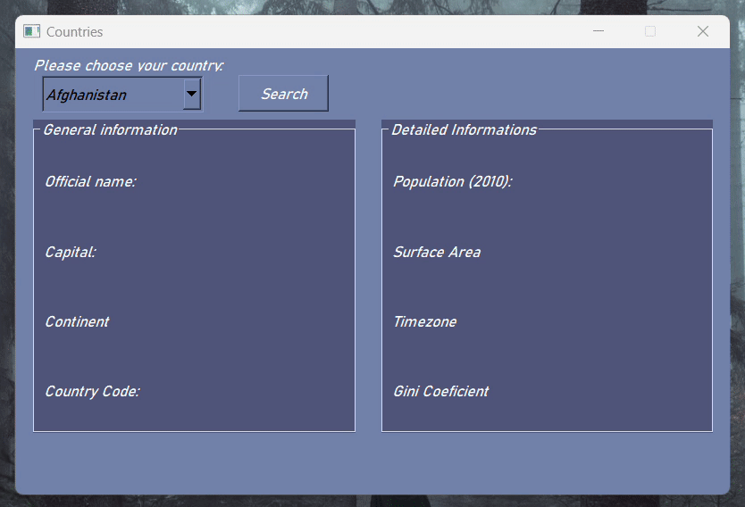

# countries-project

## How to install
1. You need to install the latest version of python. Remember to add python to PATH during the installation. 
2. In the terminal, type ``pip install PyQt5``
3. Clone the repository, then open the terminal in that same directory and type ``python main.py``

## How to use 
Simply select the desired country from the drop down menu to know more informations about whatever country

